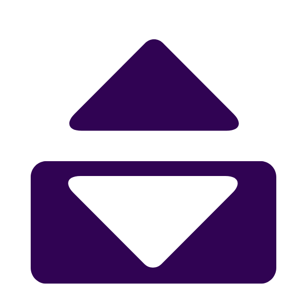

Howdy! 

This is my space for building things. 

**What kind of things you ask?**  Anything useful, really!

**What's your philosophy when building?** It should look modern and clean, be useful and most importantly, be as privacy-first as possible.

<h3>Tech stack</h3>

**Main Stack**
<table>
  <tr >
    <td align="center">

 

 

  </tr>
</table>

**Stacks I know**
<table>
  <tr>
    <td align="center">

 

  </tr>
</table>

 And I am keeping an eye out for a little birdie... 
 

<h3>Pursuits</h3>

 **TallyX**
 - The first! Saw some counter extensions on chrome that didn't look good so I decided to make my own and dial it up to a 11.
 - It's not rocket science but it taught me a lot about the development process.
 - [check it out here](https://chromewebstore.google.com/detail/tallyx/allbbmgnnlnnefodaammcefaoiogfenp)

 **BuddyIn (INP)**
 - Applying to jobs is hard + I'm good at coding + Most available tools are AI spam bots = A *quality-over-quantity* approach based application tool

**TwitterDigest (side Project for Sandeep Nailwal (Polygon Foundation))** 
- Using the now prodigious OpenClaw to parse and summarize a twitter account every 3 hours on a VPS and send info to a local dashboard anywhere in the world, *fast*.

